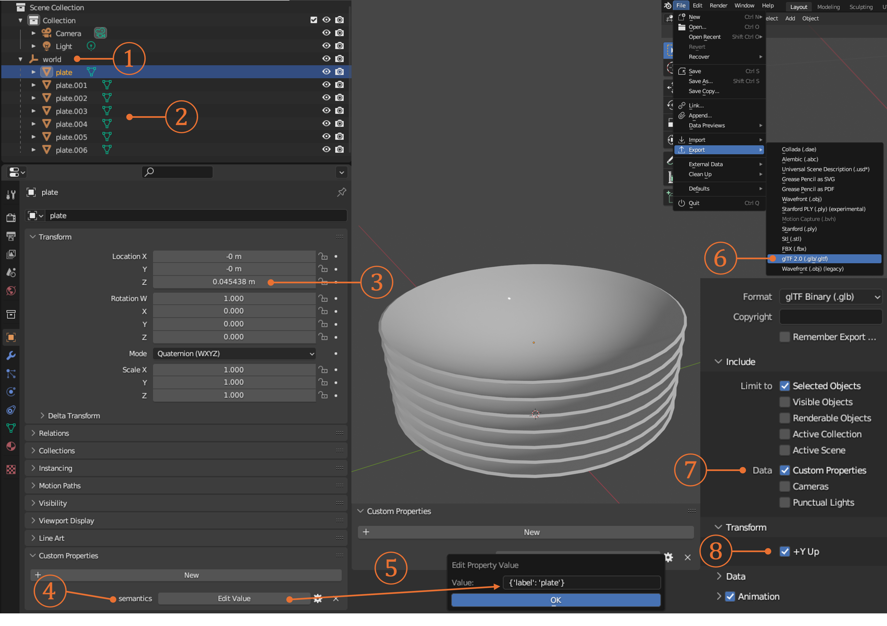

# SceneMotifCoder

### SceneMotifCoder: Example-driven Visual Program Learning for Generating 3D Object Arrangements

[Hou In Ivan Tam](https://iv-t.github.io/), [Hou In Derek Pun](https://houip.github.io/), [Austin T. Wang](https://atwang16.github.io/), [Angel X. Chang](https://angelxuanchang.github.io/), [Manolis Savva](https://msavva.github.io/)


[Page](https://3dlg-hcvc.github.io/smc/) | [Paper](https://arxiv.org/abs/2408.02211) | [Data](https://github.com/3dlg-hcvc/smc/releases/download/v1.0/examples.zip)

## Setup Environment
We recommend using `mamba` to manage the environment.
`mamba` is a drop-in replacement for `conda` that is significantly faster and better at solving dependencies.
Run the following commands to create and activate the environment.
Replace `mamba` with `conda` in the following commands if you use `conda`.
```bash
# Create and activate the environment
mamba env create -f environment.yml
mamba activate smc
```
Create a `.env` file in the root directory of the project and add your OpenAI API key as follows:
```bash
# Inside .env
OPENAI_API_KEY=<YOUR_API_KEY>
```

## Download Data
### Example Arrangements
Download the example arrangements [here](https://github.com/3dlg-hcvc/smc/releases/download/v1.0/examples.zip) and extract the contents to the root of the project.

### Assets for Retrieval
SMC retrieves 3D models from the [Habitat Synthetic Scenes Dataset (HSSD)](https://3dlg-hcvc.github.io/hssd/).
To download the dataset, accept the terms and conditions of the dataset on Hugging Face [here](https://huggingface.co/datasets/hssd/hssd-models).
Then, login to Hugging Face on your machine ([guide](https://huggingface.co/docs/huggingface_hub/en/quick-start#authentication)) and clone the dataset repository (~72GB) at the root of the project:
```bash
cd smc

huggingface-cli login

git lfs install
git clone https://huggingface.co/datasets/hssd/hssd-models
```
Lastly, download the asset metadata `.csv` file [here](https://huggingface.co/datasets/hssd/hssd-hab/tree/main/semantics) and place it inside the `hssd-models` directory.

### Directory Structure
You should now have the following directory structure:
```
smc
├── examples
│   ├── a_stack_of_seven_plates.glb
│   ├── ...
├── hssd-models
│   ├── semantics_objects.csv
│   ├── ...
|── ...
```

## Learn Meta-Program from Example
Run the following command to learn a meta-program from an example arrangement:
```bash
python learn.py --file examples/a_stack_of_seven_plates.glb --desc "a stack of seven plates"
```
The motif program and meta-program will be saved in `libraries/` under the corresponding directories.

To improve a meta-program with more examples, simply run the command again with a different example arrangement of the same motif type.
SMC will automatically update the meta-program using the new example.

## Generate New Arrangement
After learning a meta-program, you can use it to generate new arrangements by running the following command:
```bash
python inference.py --desc "a stack of four books"
```
By default, the generated arrangement will be saved under `outputs/`. See `inference.py` for more options.

## Create Example Arrangements
You can create your own example arrangements using your favorite 3D modeling software.
Here we provide a simple guide for using [Blender 3.6 LTS](https://www.blender.org/download/releases/3-6/):

1. Create an empty object that serves as the root node (`world`) of the arrangement.
2. Add object meshes as children of the world node.
3. Adjust the transformations of the object meshes to create the desired arrangement.
4. Add a custom property to each object mesh. Change the property's name to `semantics` and type to `python`.
5. Set the property's value to specify the object's label. For example, `{'label': 'plate'}`.
6. Export the world node along with its children as a `.glb` file.
7. Include custom properties in the export settings by checking the `Custom Properties` option under `Include > Data`. (Default is unchecked).
8. Make sure to check the `+Y Up` option under `Transform` to ensure the correct orientation. (Default is checked).
9. Save the file.

Your new arrangement, a `.glb` file, is now ready to be used as an example for learning a meta-program.



## Citation
Please cite our work if you find it helpful:
```
@article{tam2024scenemotifcoder,
    author        = {Tam, Hou In Ivan and Pun, Hou In Derek and Wang, Austin T. and Chang, Angel X. and Savva, Manolis},
    title         = {{SceneMotifCoder: Example-driven Visual Program Learning for Generating 3D Object Arrangements}},
    year          = {2024},
    eprint        = {2408.02211},
    archivePrefix = {arXiv}
}
```

## Acknowledgements
This work was funded in part by a CIFAR AI Chair, a Canada Research Chair, NSERC Discovery Grant, and enabled by support from WestGrid and the [Digital Research Alliance of Canada](https://alliancecan.ca/).
We thank Qirui Wu, Jiayi Liu, and Han-Hung Lee for helpful discussions and feedback.
